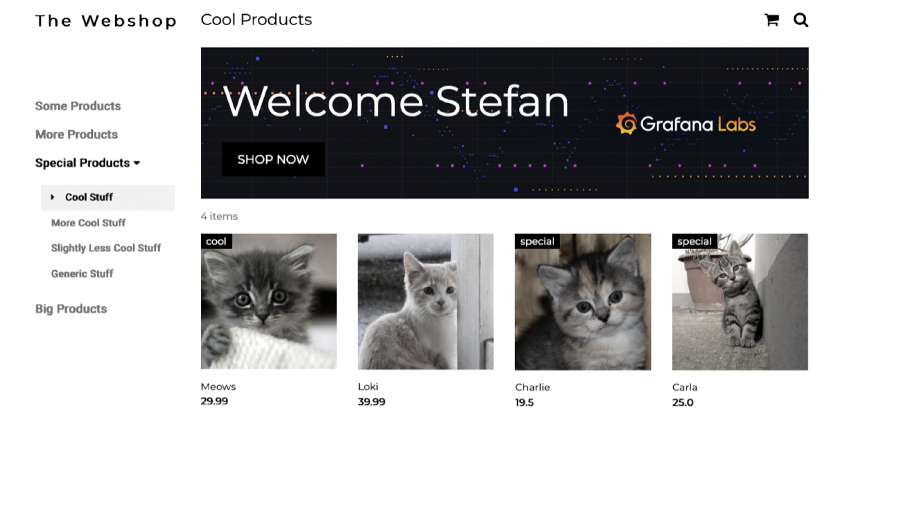
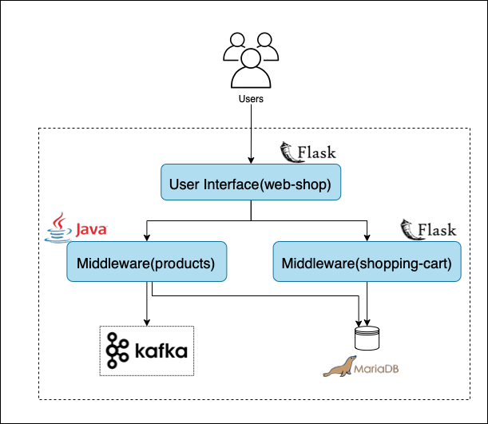
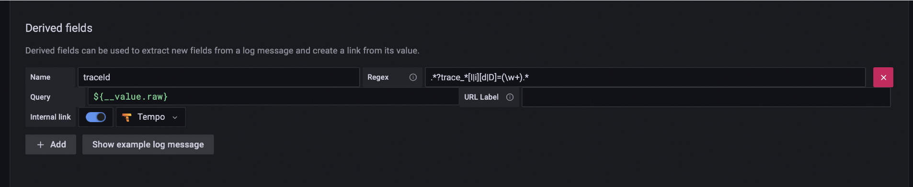
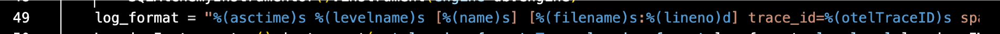
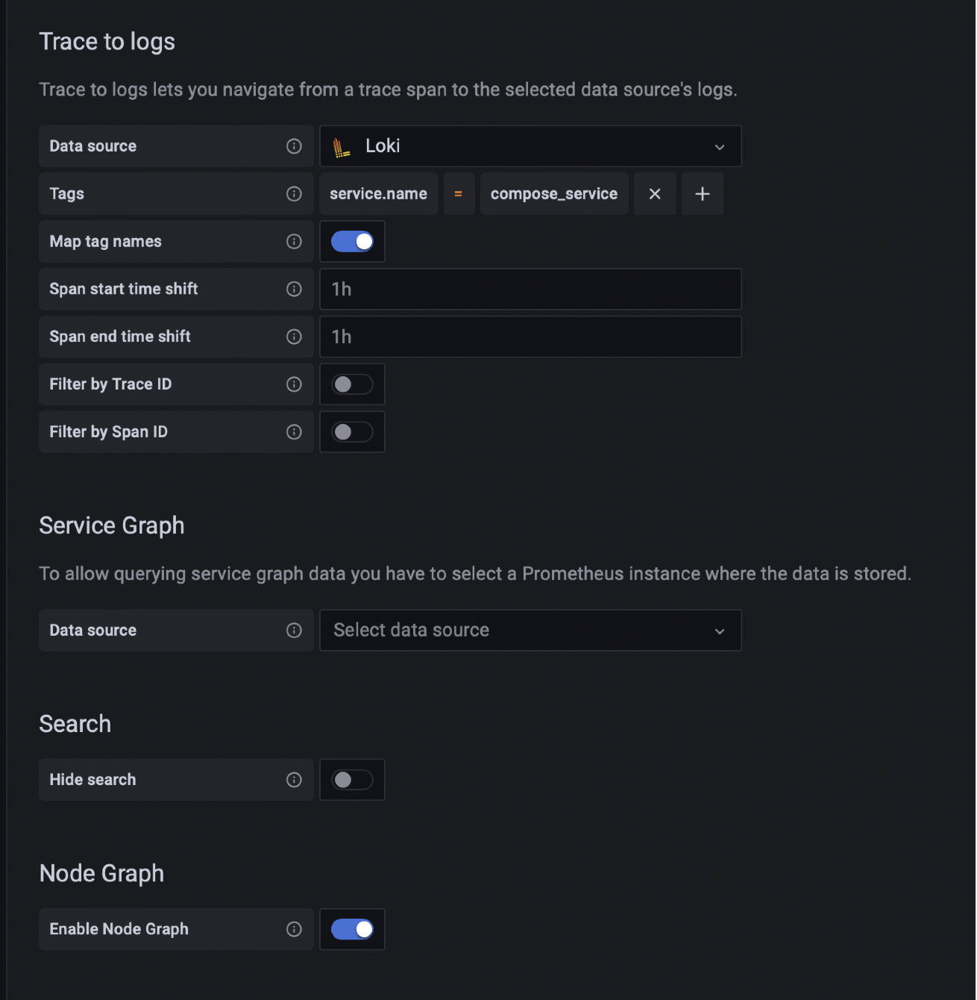
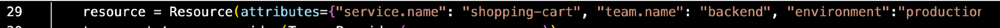

# Zero to Observable in < 30 Min

## Demo Objective

This workshop will walk you through how to collect and visualize metrics, logs and traces from your distributed microservice application.

## Prerequisites
[Sign up for our free Grafana Cloud Account](https://grafana.com/)

[Install docker](https://docs.docker.com/engine/install/)

[Install the loki docker driver client](https://grafana.com/docs/loki/latest/clients/docker-driver/)

Download a Text Editor (ex: [Visual Studio Code](https://code.visualstudio.com/download))

## Dependencies
- At infrastructure level, the Workshop Sandbox depends on
  - [Docker](https://docs.docker.com/engine/), tested with version 20.10.17 
  - [Docker Compose](https://docs.docker.com/compose/), tested with version 2.6.0
- At monitoring level, the whole workshop depends on
  - [Loki’s Docker driver](https://grafana.com/docs/loki/latest/clients/docker-driver/), tested with version 2.5.0
- At application level, the [Web Shop Observability demo](https://github.com/Condla/web-shop-o11y-demo) has all the dependencies resolved

## Application Overview
This demo spins up a simplified containerized "web shop" application.



The application consists of 5 microservices:
- web-shop: a user interface that allows you to add items to a shopping cart, as well as delete all items in the shopping cart.
- shopping-cart: a backend service that interacts with a MariaDB instance. It persists the shopping cart items of the different users.
- products: a backend service that serves the available products of the web shop.
- mariadb: A mariadb instance to persist products and shopping cart items.
- shopping cart simulator: a service that simulates light user traffic by adding things to the shopping cart via the web-shop API.
- broker: a kafka broker to persist checked out shopping carts before they are reset.



#### Architecture Overview
- The web shop UI is a Python Flask service that renders 2 HTML pages: 
    - landing page- loads products by requesting them from the products API
    - shopping cart view- interacts with the shopping cart service to get the current shopping cart items from the user
- The shopping cart service is written in Flask and offers an API to interact with MariaDB
- The products service is written in Java Spring Boot and offers an API to load the currently available shop items from MariaDB
- The products service has a Kafka producer and consumer implemented:
    - The producer- sends the content of the shopping cart as JSON to a Kafka topic
    - The consumer- logs the message

## Part 0: Useful Information to Know
Pulling the repo:
```bash
git clone https://github.com/Mkrummz/mtl_demo.git
cd mtl_demo
```
Starting the application:
```bash
sh ./start_app.sh
```
To populate the storefront run:
```bash
sh ./load_store.sh
```
Generating fake user traffic for the website:
```bash
sh ./load_testing/generate_load.sh
```
To see status of docker containers:
```bash
docker compose ps
```
Restarting the Grafana Agent:
```bash
docker-compose restart agent
```

Stop Docker Containers
```bash
docker-compose down
```

Website URL: http://localhost:3389/shop?name=User


## Part 1: Instrumentation and Collection of Metrics Data
You will start off by instrumenting our application. Using the architecture diagram from above you will go service by service to orchestrate the collection of the telemetry data.

Once instrumented, you will be sending this telegemery data to [Grafana Cloud](https://grafana.com/products/cloud/?pg=blog&plcmt=body-txt) (fully-managed composable observability platform) via the Grafana Agent (all-in-one agent for collecting metrics, logs, and traces).

In this walkthrough we will be creating our own Grafana Agent Config file to show just how easy it is to do this by hand. If you are not already familiar with the Grafana agent navigate to the [Grafana Agent Documentation](https://grafana.com/docs/agent/latest/) and familiarize yourself with the agent before proceeding.

The Grafana Agent supports configuring multiple independent “subsystems.” Each subsystem helps you collect data for a specific type of telemetry.

### Integrations subsystem

The [integrations_config](https://grafana.com/docs/agent/latest/configuration/integrations/) block configures how the Agent runs integrations that scrape and send metrics without needing to run specific Prometheus exporters or manually write scrape_configs.

## Make a folder and file for the agent config
```bin
mkdir config
cd config
touch agent.yaml
cd ..
```

add the following to the top of the agent.yaml file
```yml
server:
  log_level: debug
```

### Copy and paste the following into agent.yaml:

```yml
integrations:
agent:
   enabled: true
node_exporter:
   enabled: true
   include_exporter_metrics: true
   relabel_configs:
      - replacement: hostname
        target_label: instance
   disable_collectors:
     - "mdadm"
```

For this application we will be using two integrations. The agent integration, which allows the agent to automatically collect and send metrics about itself. As well as the node_exporter. Which is an embedded version of [node_exporter](https://github.com/prometheus/node_exporter) and allows for collecting metrics from the UNIX system that node_exporter is running on. It provides a significant amount of collectors that are responsible for monitoring various aspects of the host system.

We have full control over how the exporter is configured in the agent configuration file allowing us to select which collectors we want enabled. In this case we disabled the mdadm collector.

### Metrics subsystem

The metrics_config block is used to define a collection of metrics instances. Each instance defines a collection of Prometheus-compatible scrape_configs and remote_write rules.

### Copy and paste the following into a text editor

```yml
Metrics:
 wal_directory: '/var/lib/grafana-agent'
 global:
   scrape_interval: 15s
   remote_write:
     - url: <Prometheus compatible remote write's API>
       basic_auth:
         username: <user name or instance ID if using Grafana Cloud>
         password: <password or API Key if using Grafana Cloud>
```

### What about Metrics Showing User Experience
We can use **Synthetic Monitoring** for this. The synthetic monitoring module in Grafana Cloud is a black box monitoring solution that allows you to extract information about the behavior of applications and services from an outside perspective. You can run remote tests on these applications or services from different locations around the world in such a way that you can identify their availability.  In each check, the metrics and logs that are collected are saved within the metrics and logs backend of the stack itself. Meaning you can access them directly via a Prometheus query with PromQL or a Loki query with LogQL.

You can do checks such as Ping via ICMP, HTTP and HTTPS websites, DNS name resolution check, TCP connections, and recently  we added a new type of check, traceroute. Traceroute checks show routes through network to a target. Check out packet loss, hop distance, and timing from any synthetic monitoring probe.

To set this up:
1. navigate to your grafana cloud instance
2. click on synthetic monitoring on the left hand side (world icon)
3. click on **Checks** in the naviagation bar
4. click add new check
5. Set **Check type** to **HTTP**, give the **Job a Name**, Put **http://18.219.118.186:3389/shop?name=User** as the **target**, select any **probe locations** you'd like (I'd recommend doing >3), and select **Save**
6. Then click **View Dashboard** (I'd recommend having one running already and after walking through the setup steps opening that one so its populated with data)


## Part 2: Instrumentation and Collection of Logs Data
### Logs subsystem
The logs_config block configures how the Agent collects logs and sends them to a Loki push API endpoint. logs_config is identical to how Promtail is configured, except deprecated fields have been removed and the server_config is not supported.

In this case we do not need to use this since we will be using the Loki Docker Driver.

### Configure the Loki’s Docker driver in the docker-compose.yml file:

```yml
x-logging: &default-logging
 driver: loki
 options:
   loki-url: <Loki endpoint for pushing logs>
   labels: namespace
   loki-relabel-config: |
     - action: replace
       source_labels: ["namespace","compose_service"]
       separator: "/"
       target_label: job
     - action: replace
       source_labels: ["container_name"]
       target_label: instance
```
The loki-url= http://<-username->:<-password->@<-Zone->.grafana.net/loki/api/v1/push

- example: https://251344:<-password->@logs-prod3.grafana.net/loki/api/v1/push

For each container defintion in the docker-compose.yml file add the following line
```yml
logging: *default-logging
```

For example:

```yml
  web-shop:
    image: "condla/web-shop:1.0"
    container_name: web-shop
    logging: *default-logging
    ports:
      - "3389:6666"
    depends_on:
      - "shopping-cart"
    networks:
      - web-shop
    restart: on-failure
```

The Docker driver for Loki is a plugin that you can install on the Docker daemon on your server. You can tell it that when you run an application, it should use that log driver. As soon as your container starts, instead of saving the logs to a file, it will just straight away send it to Loki.
Because we are within Docker, we are able to do service discovery around the name of the container and the stack that is within. That makes using Loki way easier, because you don’t need to set up anything else. You just do it once on the daemon, and then it’s ready to go. Unlike promtail, the Docker driver doesn’t require you to configure any files.

## Part 3: Instrumentation and Collection of Log Data
Traces subsystem allows you to collect spans to send to Grafana Tempo. Grafana Agent collects traces and forwards them to Tempo using its traces subsystem. This is done using the upstream [OpenTelemetry Collector](https://github.com/open-telemetry/opentelemetry-collector). Grafana Agent can ingest OpenTelemetry, OpenCensus, Jaeger, Zipkin, or Kafka spans. 

### Write a Configuration File for the Grafana Agent
```yml
configs:
 - name: latencyEndpoint
   remote_write:
     - endpoint: <Tempo compatible remote write's API>
       basic_auth:
         username: <user name or instance ID if using Grafana Cloud>
         password: <password or API Key if using Grafana Cloud>
   receivers:
     otlp:
       protocols:
         grpc:
         http:
   spanmetrics:
     dimensions:
       - name: http.method
       - name: http.target
       - name: team.name
     handler_endpoint: 0.0.0.0:1234
```

### Enable Logging in the Microservices:

#### Shopping-cart microservice (backend API)
Python code can be auto-instrumented with OpenTelemetry libraries. It is added at initialization time in [shopping-cart/wsgi.py]() file (lines 8-20):

``` py
from prometheus_flask_exporter import PrometheusMetrics
from opentelemetry import trace
from opentelemetry.sdk.trace import TracerProvider
from opentelemetry.sdk.trace.export import (
    ConsoleSpanExporter,
    SimpleSpanProcessor,
)
from opentelemetry.sdk.trace.export import BatchSpanProcessor
from opentelemetry.exporter.otlp.proto.grpc.trace_exporter import OTLPSpanExporter
from opentelemetry.sdk.resources import Resource
from opentelemetry.instrumentation.flask import FlaskInstrumentor
from opentelemetry.instrumentation.requests import RequestsInstrumentor
from opentelemetry.instrumentation.logging import LoggingInstrumentor
from opentelemetry.instrumentation.wsgi import OpenTelemetryMiddleware
```

and then add the following to lines 27-49

```py
@postfork
def init_tracing():
    resource = Resource(attributes={"service.name": "web-shop", "team.name": "frontend", "environment":"production"})
    trace.set_tracer_provider(TracerProvider(resource=resource))
    otlp_exporter = OTLPSpanExporter(endpoint=environ.get("OTEL_EXPORTER_OTLP_ENDPOINT"), insecure=True)
    span_processor = BatchSpanProcessor(otlp_exporter)
    trace.get_tracer_provider().add_span_processor(span_processor)

    # uncomment for local OTel debugging to get traces/span to console:
    #trace.get_tracer_provider().add_span_processor(SimpleSpanProcessor(ConsoleSpanExporter()))

    # be careful not to call this line before the paragraph above!
    # getting the tracer explicitly is only required for the LoggingInstrumentor below
    # using "opentelemetry-instrument" to do auto instrumentation does not work either for the same reason
    tracer = trace.get_tracer(__name__)

    # instrumentation
    PrometheusMetrics(app)
    FlaskInstrumentor().instrument_app(app)
    app.wsgi_app = OpenTelemetryMiddleware(app.wsgi_app)
    RequestsInstrumentor().instrument()
    log_format = "%(asctime)s %(levelname)s [%(name)s] [%(filename)s:%(lineno)d] trace_id=%(otelTraceID)s span_id=%(otelSpanID)s resource.service.name=%(otelServiceName)s - %(message)s"
    LoggingInstrumentor().instrument(set_logging_format=True, logging_format=log_format, log_level=logging.INFO, tracer_provider=tracer)
```

#### Shopping-cart microservice (backend API)

Python code can be auto-instrumented with OpenTelemetry libraries. It is added at initialization time in [web-shop/wsgi.py]() file (lines 7-20):

``` py
from prometheus_flask_exporter import PrometheusMetrics
from opentelemetry import trace
from opentelemetry.sdk.trace import TracerProvider
from opentelemetry.sdk.trace.export import (
    ConsoleSpanExporter,
    SimpleSpanProcessor,
)
from opentelemetry.sdk.trace.export import BatchSpanProcessor
from opentelemetry.exporter.otlp.proto.grpc.trace_exporter import OTLPSpanExporter
from opentelemetry.sdk.resources import Resource
from opentelemetry.instrumentation.flask import FlaskInstrumentor
from opentelemetry.instrumentation.sqlalchemy import SQLAlchemyInstrumentor
from opentelemetry.instrumentation.logging import LoggingInstrumentor
from opentelemetry.instrumentation.wsgi import OpenTelemetryMiddleware

```

and then add the following to lines 27-51

```py
@postfork
def init_tracing():
    resource = Resource(attributes={"service.name": "shopping-cart", "team.name": "backend", "environment":"production"})
    trace.set_tracer_provider(TracerProvider(resource=resource))
    otlp_exporter = OTLPSpanExporter(endpoint=environ.get("OTEL_EXPORTER_OTLP_ENDPOINT"), insecure=True)
    span_processor = BatchSpanProcessor(otlp_exporter)
    trace.get_tracer_provider().add_span_processor(span_processor)

    # uncomment for local OTel debugging to get traces/span to console:
    #trace.get_tracer_provider().add_span_processor(SimpleSpanProcessor(ConsoleSpanExporter()))

    # be careful not to call this line before the paragraph above!
    # getting the tracer explicitly is only required for the LoggingInstrumentor below
    # using "opentelemetry-instrument" to do auto instrumentation does not work either for the same reason
    tracer = trace.get_tracer(__name__)

    # instrumentation
    PrometheusMetrics(app)
    FlaskInstrumentor().instrument_app(app)
    app.wsgi_app = OpenTelemetryMiddleware(app.wsgi_app)
    with app.app_context():
        SQLAlchemyInstrumentor().instrument(engine=db.engine)
    log_format = "%(asctime)s %(levelname)s [%(name)s] [%(filename)s:%(lineno)d] trace_id=%(otelTraceID)s span_id=%(otelSpanID)s resource.service.name=%(otelServiceName)s - %(message)s"
    LoggingInstrumentor().instrument(set_logging_format=True, logging_format=log_format, log_level=logging.INFO, tracer_provider=tracer)
```

## Create new Datasources
You will need to create a new Loki, and Tempo Data Source as you cannot change the ones that were automatically provisioned.

### Logs to Traces correlation datasource setup:
Traceid is in the log line.

#### Data Source Configuration
name =  ``` traceid ```

regex = ``` .*?trace_*[I|i][d|D]=(\w+).* ```

internal link = tracing



We got these values from: line 49 of shopping-cart/wsgi.py and line 48 of web-shop/wsgi.py



### Traces to Logs correlation setup:
Loki can recieve a set of labels along with log line. These labels are used to index log entries and query. By default the Docker driver will add:
- filename: where the log is written to on disk
- host: the hostname where the log has been generated
- swarm_stack, swarm_service: added when deploying from Docker Swarm
- compose_project, compose_service: added when deploying with Docker Compose

#### Data Source Configuration
Data source =  ``` Loki ```

Tags = ```bash service.name ``` = ``` compose_service ```

Toggle on **Map tag names** and **Enable Node Graph**



We got these values from: line 29 of shopping-cart/wsgi.py and line 29 of web-shop/wsgi.py



## Acknowledgements

[Web Shop Observability](https://github.com/Condla/web-shop-o11y-demo) was created by Stefan Dunkler

Adapted from a [workshop](https://docs.google.com/presentation/d/1TWWFg1j-Inu4aoWzY63m9KQAKBzIwOH9hKPTSTol7Qk/edit#slide=id.g135b07445ea_0_142) put together by Raúl Marín 
